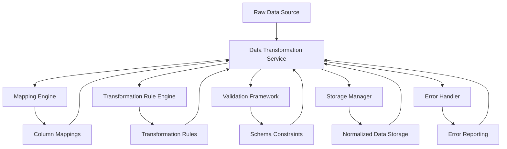
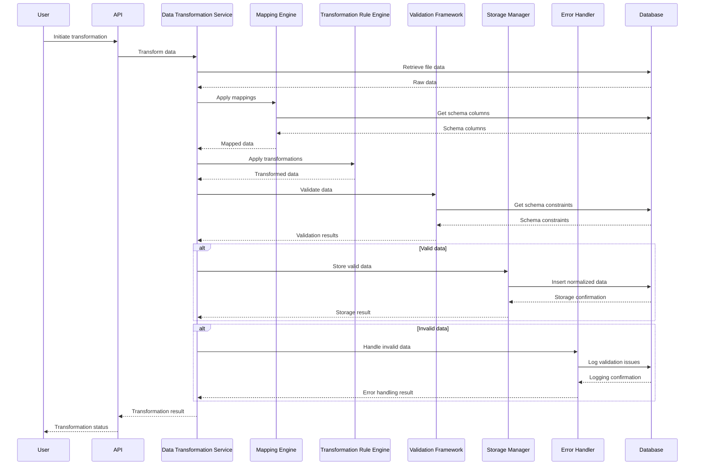
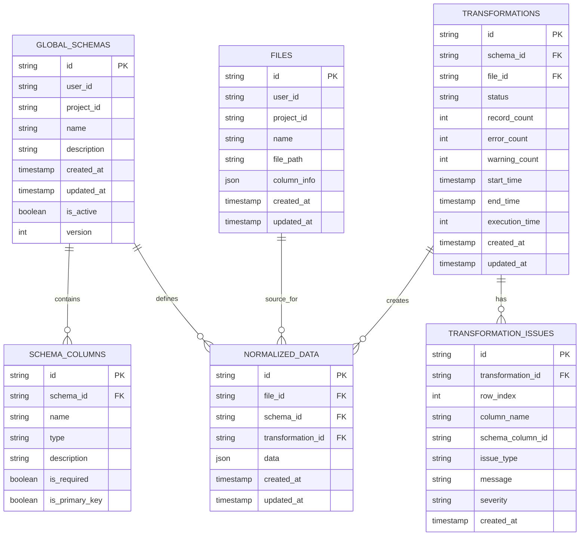
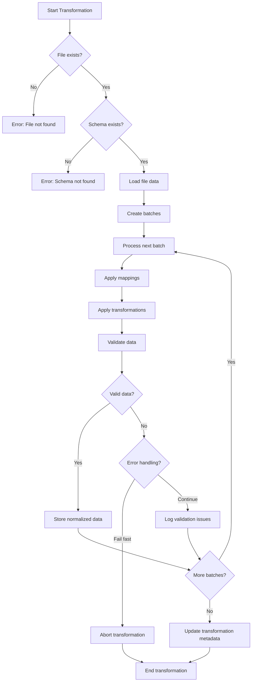
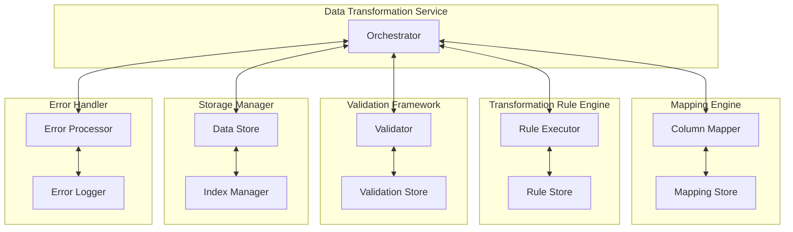
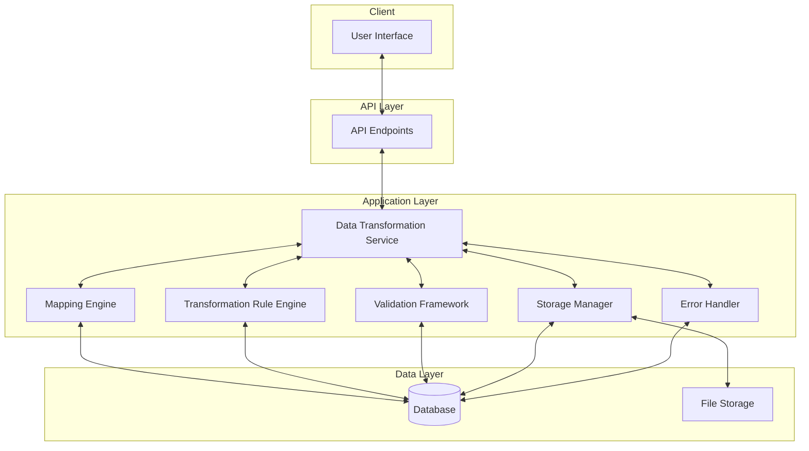

# Data Transformation Architecture Diagrams

This document contains diagrams illustrating the architecture and flow of the data transformation system.

## Component Architecture

## Data Flow Sequence

## Database Schema

## Processing Flow

## Component Interaction

## Deployment Architecture

These diagrams provide a visual representation of the data transformation architecture, showing the relationships between components, the flow of data through the system, and the database schema for storing normalized data.
