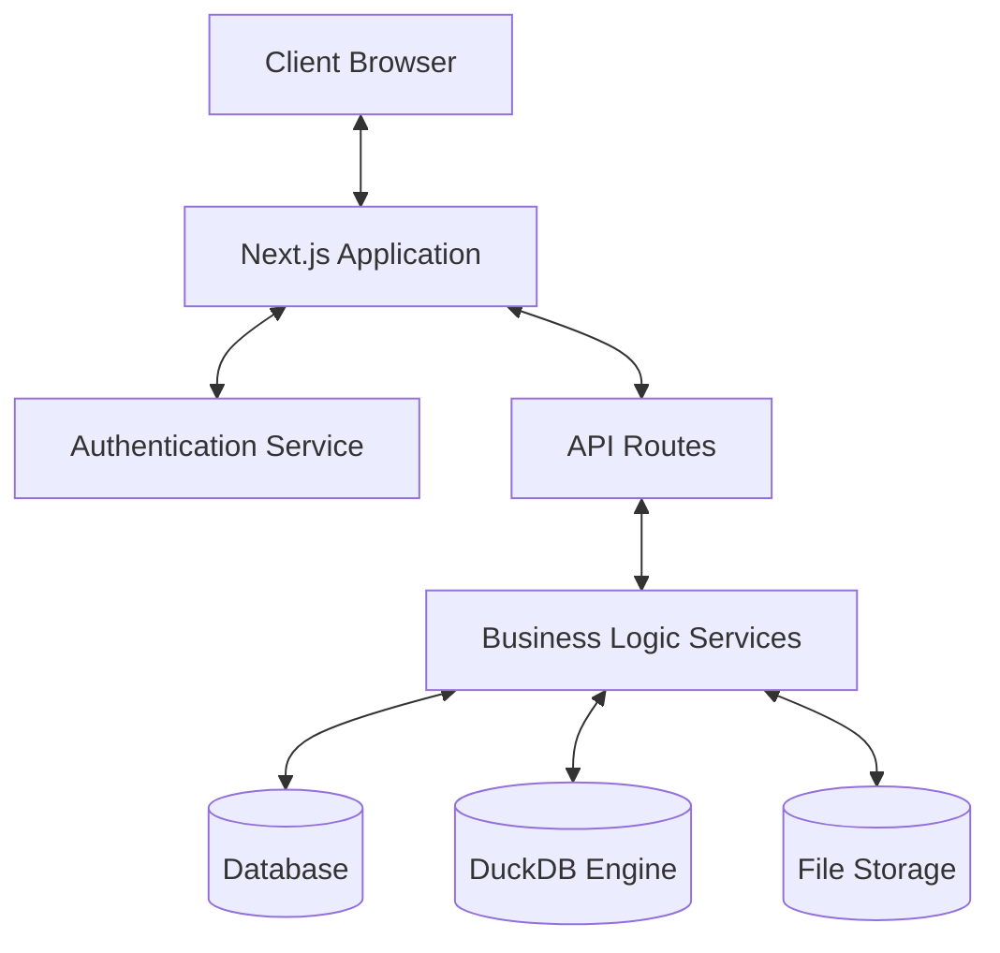
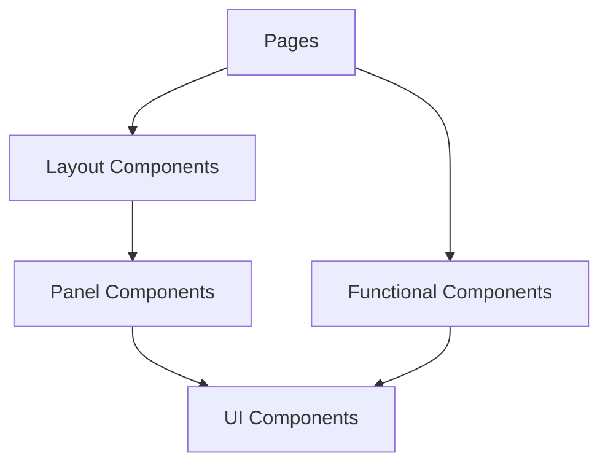
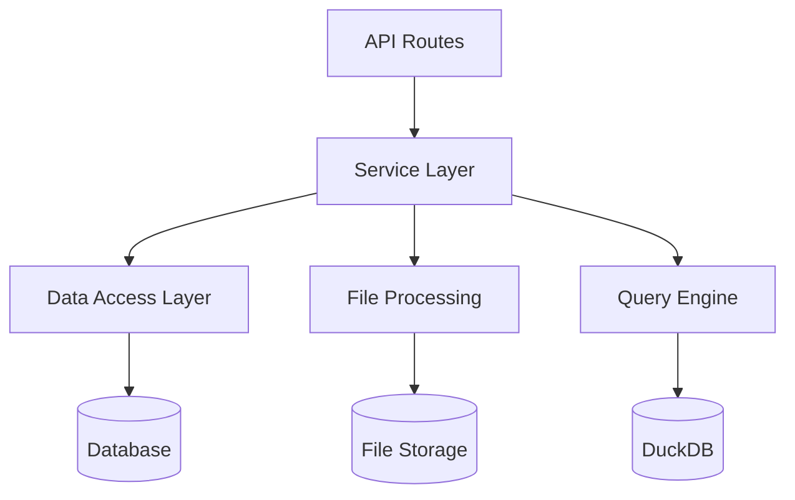
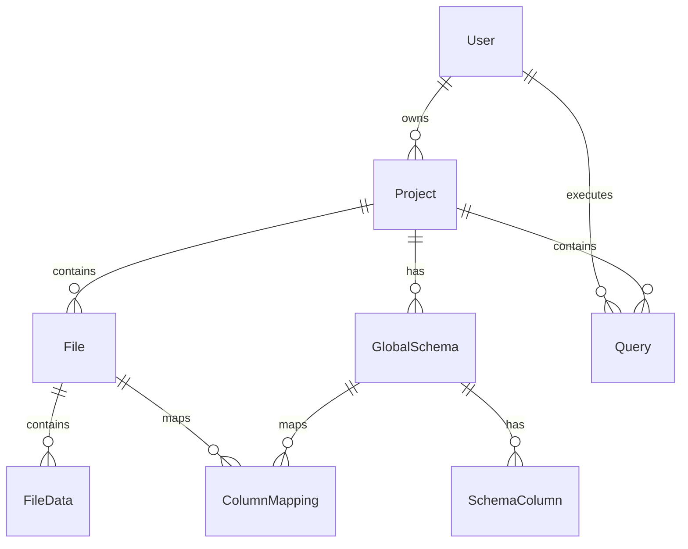
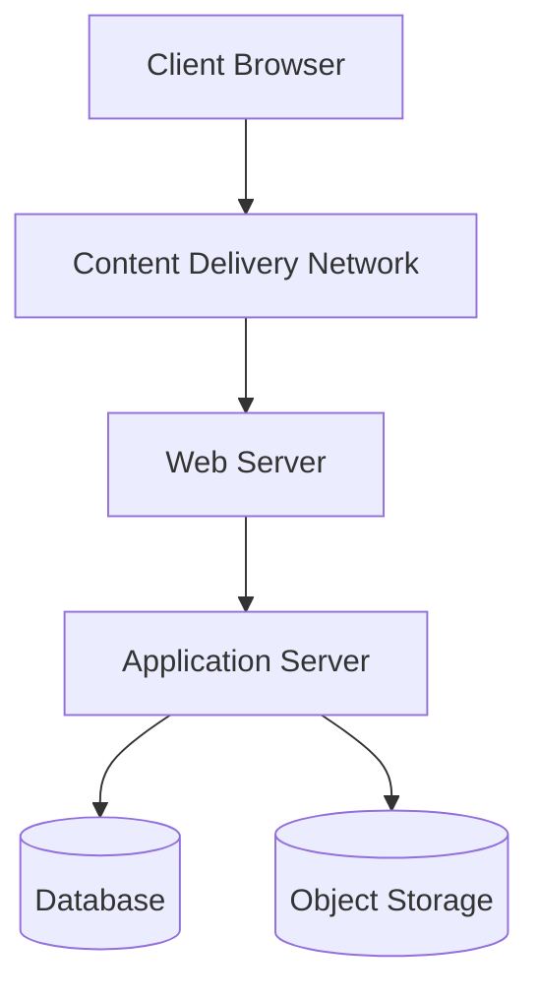

# Architecture

This document outlines the high-level architecture of the RapidDataChat application, including its components, data flow, and design patterns.

## System Architecture

RapidDataChat follows a modern web application architecture with the following key components:

### Key Components

1. **Client**: React-based frontend running in the browser
2. **Next.js Application**: Server-side rendered React application
3. **Authentication Service**: NextAuth.js for user authentication
4. **API Routes**: Next.js API routes for backend functionality
5. **Business Logic Services**: TypeScript services for core application logic
6. **Database**: Persistent storage for user data, projects, and metadata
7. **DuckDB Engine**: In-memory analytical database for data querying
8. **File Storage**: Storage for uploaded data files

## Frontend Architecture

The frontend follows a component-based architecture using React and TypeScript:

### Key Frontend Patterns

1. **Component Composition**: Building complex UIs from smaller, reusable components
2. **State Management**: Using React hooks for local state and context for shared state
3. **Responsive Design**: Using Tailwind CSS for responsive layouts
4. **Progressive Enhancement**: Ensuring core functionality works without JavaScript

## Backend Architecture

The backend is structured around Next.js API routes and service-oriented architecture:

### Key Backend Patterns

1. **Service Layer**: Encapsulating business logic in dedicated services
2. **Repository Pattern**: Abstracting data access through repositories
3. **Middleware**: Using middleware for cross-cutting concerns like authentication
4. **Error Handling**: Centralized error handling and logging

## Data Model

The core data model includes the following entities:

### Key Entities

1. **User**: Application user with authentication details
2. **Project**: Container for files, schemas, and queries
3. **File**: Metadata about uploaded files
4. **FileData**: Actual data from uploaded files
5. **GlobalSchema**: Schema definition for normalizing data
6. **SchemaColumn**: Column definition within a schema
7. **ColumnMapping**: Mapping between file columns and schema columns
8. **Query**: Natural language query and its execution details

## Deployment Architecture

The application is designed to be deployed as a Next.js application with the following infrastructure:

### Deployment Components

1. **Content Delivery Network**: For static assets and edge caching
2. **Web Server**: For serving the Next.js application
3. **Application Server**: For running the application logic
4. **Database**: For persistent storage
5. **Object Storage**: For file storage

## Security Architecture

The application implements several security measures:

1. **Authentication**: Using NextAuth.js for secure user authentication
2. **Authorization**: Role-based access control for resources
3. **Data Validation**: Input validation on all API endpoints
4. **CSRF Protection**: Cross-Site Request Forgery protection
5. **Content Security Policy**: Restricting resource loading
6. **Secure Headers**: HTTP security headers
7. **Data Encryption**: Encryption for sensitive data

For more detailed information about specific components and implementations, refer to the dedicated documentation pages.
