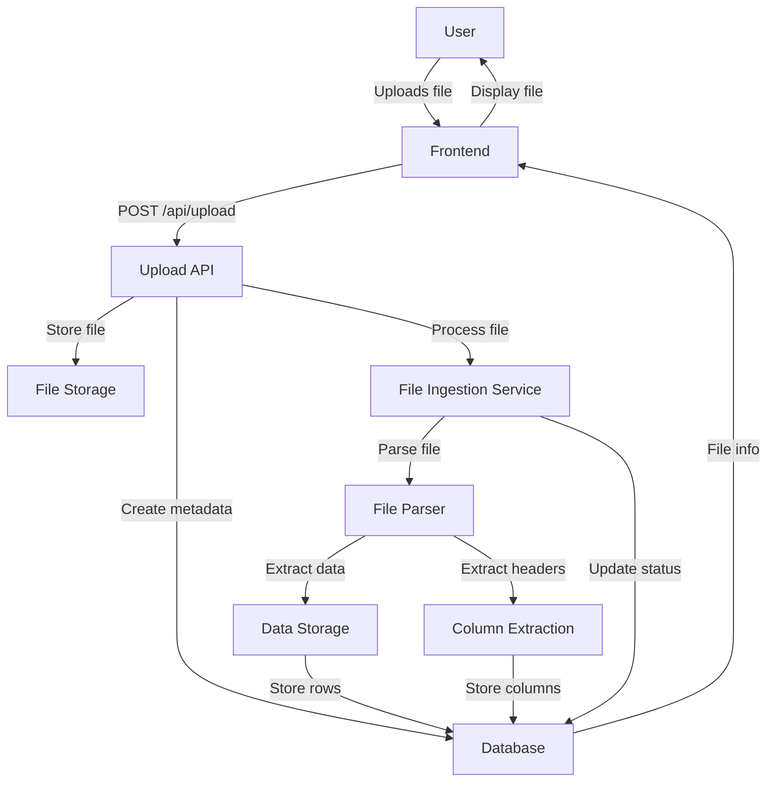
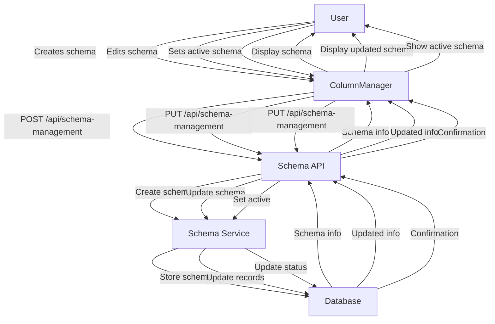
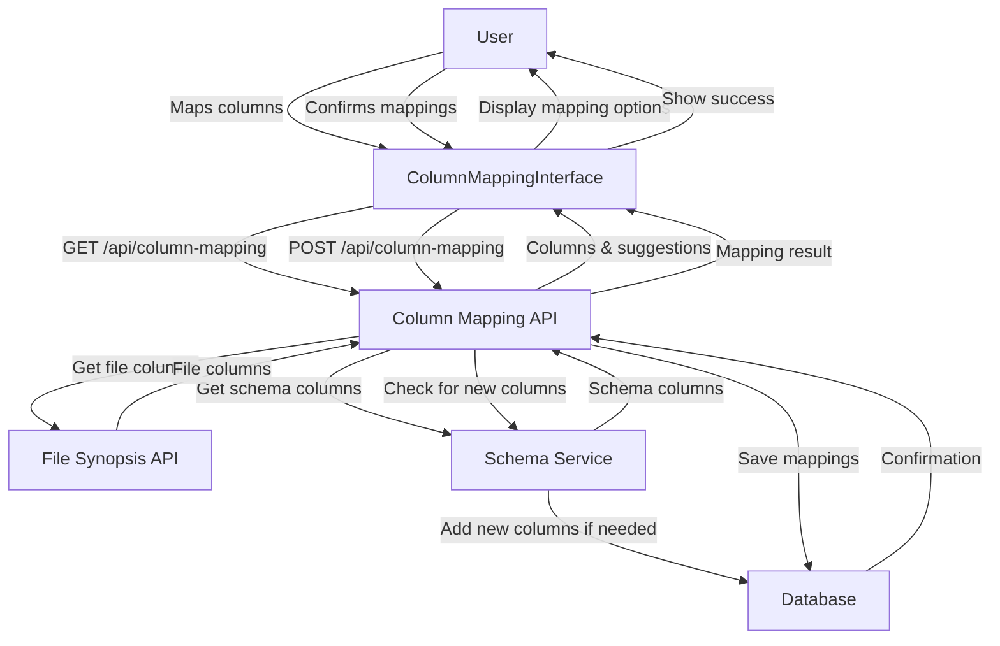
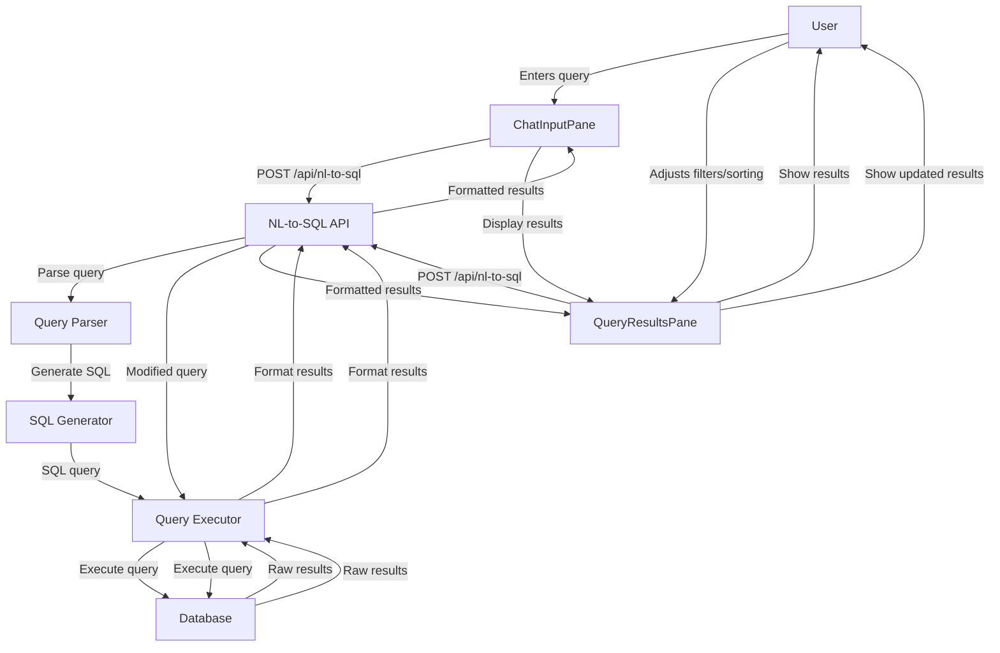
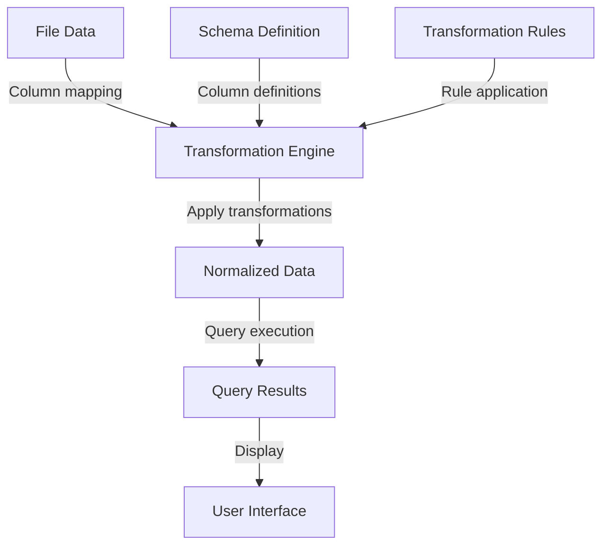
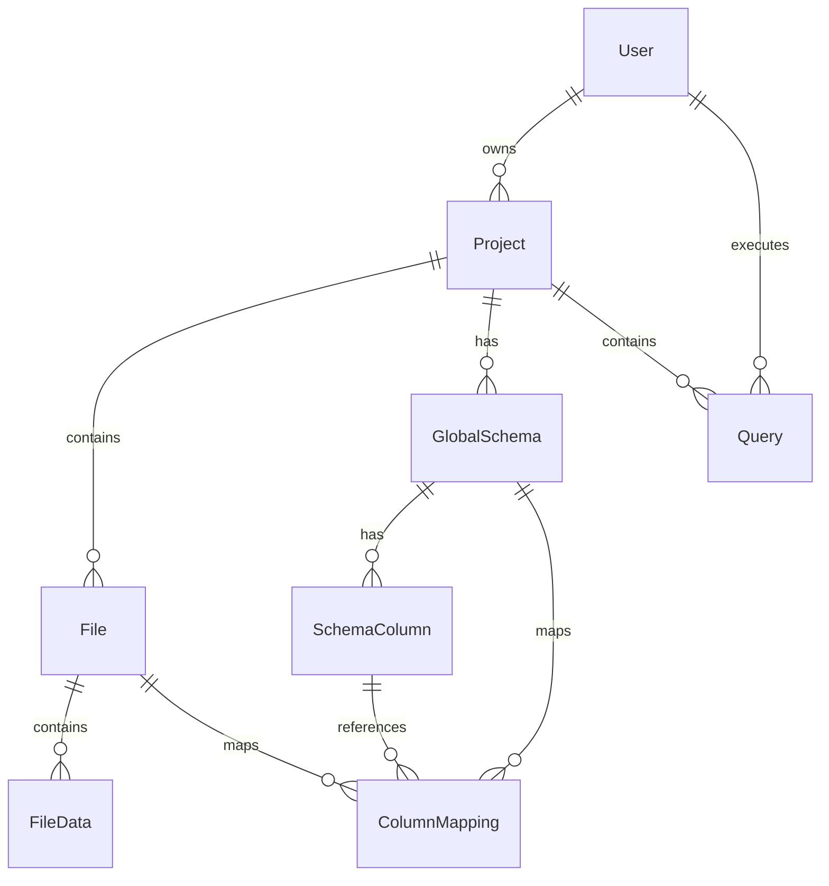
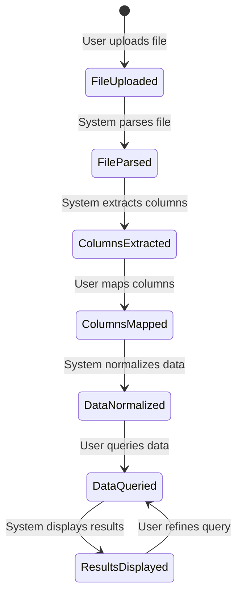
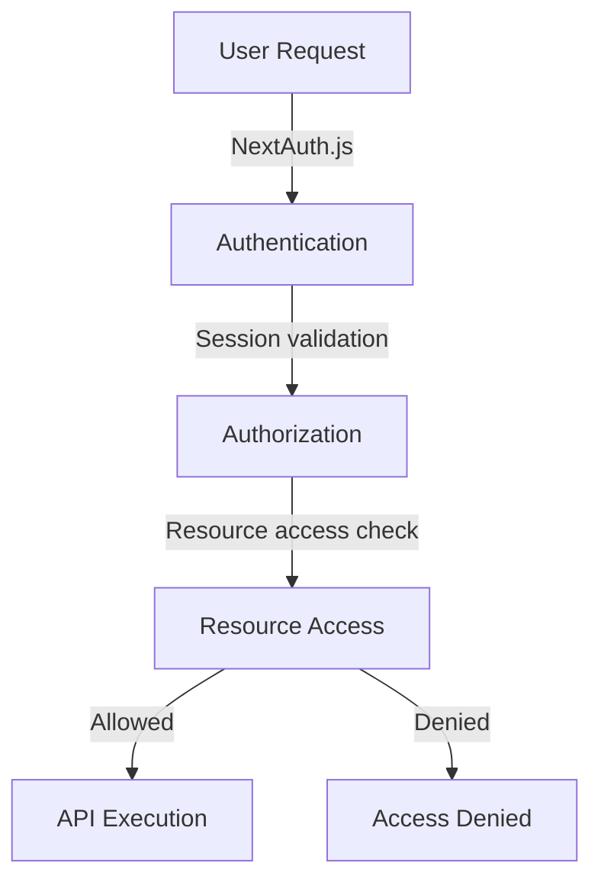
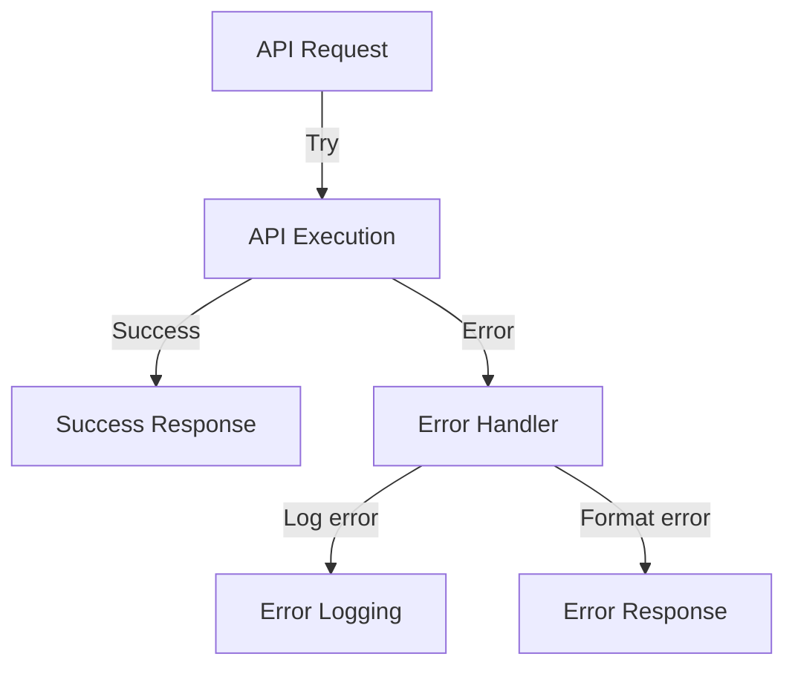
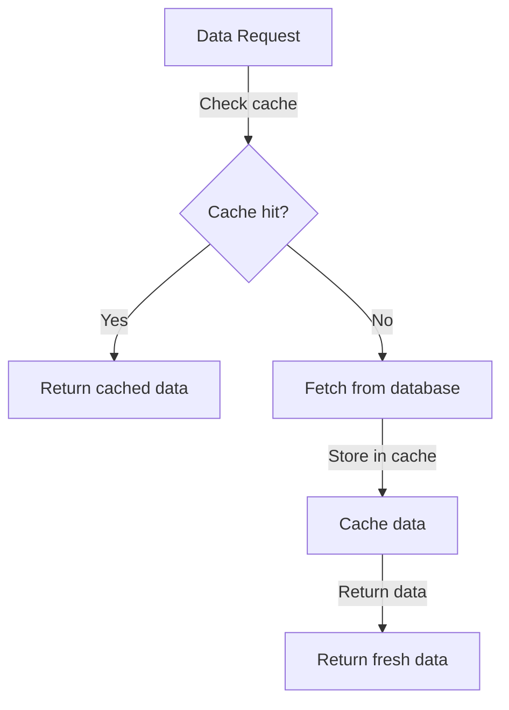

# Data Flow

This document describes the data flow within the RapidDataChat application, focusing on how data moves through the system from upload to querying.

## Overview

RapidDataChat processes data through several stages:

1. **File Upload**: Users upload data files (CSV, Excel)
2. **File Processing**: Files are parsed and stored
3. **Schema Management**: Global schemas are created and managed
4. **Column Mapping**: File columns are mapped to schema columns
5. **Data Querying**: Users query data using natural language
6. **Result Presentation**: Query results are displayed to users

## File Upload Flow

### Detailed Steps

1. User selects a file through the FileUpload component
2. Frontend validates the file and sends it to the Upload API
3. Upload API:
   - Stores the file in the file storage system
   - Creates a file metadata record in the database
   - Initiates asynchronous file processing
4. File Ingestion Service:
   - Parses the file based on its format (CSV, Excel)
   - Extracts headers (columns) and data rows
   - Stores the data in the database
   - Updates the file status (pending → processing → active)
5. Frontend displays the file in the FileList component
6. FileList component fetches column information for the file

## Schema Management Flow

### Detailed Steps

1. User creates a schema through the ColumnManager component:
   - From file columns or custom column definitions
2. ColumnManager sends the schema data to the Schema Management API
3. Schema Management API:
   - Validates the schema data
   - Calls the Schema Service to create the schema
4. Schema Service:
   - Creates a schema record in the database
   - Creates schema column records
   - Sets the schema as active if requested
5. Frontend displays the created schema
6. User can edit the schema or set it as active

## Column Mapping Flow

### Detailed Steps

1. User selects a file and navigates to the column mapping interface
2. ColumnMappingInterface fetches:
   - File columns from the File Synopsis API
   - Schema columns from the Schema Service
   - Existing mappings if any
3. ColumnMappingInterface displays:
   - File columns
   - Schema columns
   - Suggested mappings based on column similarity
4. User creates or adjusts mappings
5. User confirms the mappings
6. Column Mapping API:
   - Checks for new columns to add to the schema
   - Updates the schema if needed
   - Saves the mappings
7. Frontend displays a success message

## Query Execution Flow

### Detailed Steps

1. User enters a natural language query in the ChatInputPane
2. ChatInputPane sends the query to the NL-to-SQL API
3. NL-to-SQL API:
   - Parses the natural language query
   - Generates an SQL query
   - Executes the query against the database
   - Formats the results
4. Frontend displays the results in the QueryResultsPane
5. User can adjust filters, sorting, or pagination
6. These adjustments trigger new queries with modified parameters

## Data Transformation Flow

### Detailed Steps

1. When a query is executed, the system:
   - Retrieves the relevant file data
   - Applies column mappings to normalize the data according to the schema
   - Applies any transformation rules defined in the mappings
   - Executes the query against the normalized data
   - Returns the results

## Data Storage Model

### Key Entities and Relationships

1. **User** owns multiple Projects
2. **Project** contains Files, GlobalSchemas, and Queries
3. **File** contains FileData and has ColumnMappings
4. **GlobalSchema** has SchemaColumns and ColumnMappings
5. **ColumnMapping** connects File columns to SchemaColumns
6. **Query** is executed by a User within a Project

## Data Lifecycle

### Lifecycle Stages

1. **FileUploaded**: File is uploaded to the system
2. **FileParsed**: File is parsed into headers and data rows
3. **ColumnsExtracted**: Columns are extracted from the file
4. **ColumnsMapped**: Columns are mapped to a global schema
5. **DataNormalized**: Data is normalized according to the schema
6. **DataQueried**: User queries the normalized data
7. **ResultsDisplayed**: Query results are displayed to the user

## Cross-Cutting Concerns

### Authentication and Authorization

All data flows in the system are subject to authentication and authorization checks:

- User authentication is handled by NextAuth.js
- Session validation occurs on each API request
- Resource access is checked based on user ownership
- API execution only proceeds if access is allowed

### Error Handling

Error handling is implemented throughout the data flow:

- API endpoints use try-catch blocks
- Errors are logged for debugging
- User-friendly error messages are returned
- Frontend displays appropriate error messages

### Caching

Caching is implemented for performance optimization:

- File synopsis data is cached to reduce database load
- Query results can be cached for repeated queries
- UI state is cached in localStorage for persistence

## Conclusion

The data flow in RapidDataChat follows a logical progression from file upload through processing, schema management, column mapping, and finally to querying and result presentation. Each stage involves specific components and services that work together to provide a seamless user experience.

Understanding this data flow is essential for maintaining and extending the application, as it provides a clear picture of how data moves through the system and how different components interact.
