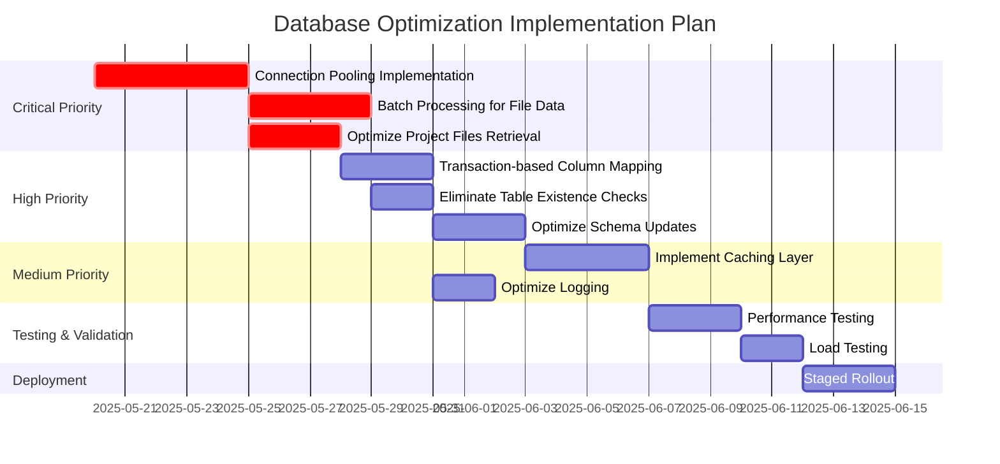

# Database Optimization Implementation Plan

This document outlines the implementation plan for optimizing database usage in the RapidDataChat application. The plan addresses the issues identified in our database usage analysis and provides a structured approach to implementing the necessary optimizations.

## Overview

Our analysis identified several critical issues with the current database implementation:

1. Inefficient connection management
2. Excessive database calls
3. Inconsistent usage patterns
4. Suboptimal query routing

This plan outlines the specific steps to address these issues, organized by priority level.

## Implementation Timeline



## Phase 1: Critical Priority Optimizations

### 1. Connection Pooling Implementation

**Tasks:**

- [ ] Create `DatabaseConnectionManager` class with connection pooling
- [ ] Refactor `ReplicaPrismaClient.useReplica` method to use connection pool
- [ ] Add connection lifecycle management (health checks, timeouts)
- [ ] Update all database access code to use the connection manager
- [ ] Add monitoring for connection pool usage

**Implementation Details:**

```typescript
// lib/database/connectionManager.ts
export class DatabaseConnectionManager {
  private static instance: DatabaseConnectionManager;
  private primaryPool: PrismaClient[] = [];
  private replicaPool: PrismaClient[] = [];
  private maxPoolSize = 10;

  // Singleton implementation
  static getInstance(): DatabaseConnectionManager {
    if (!DatabaseConnectionManager.instance) {
      DatabaseConnectionManager.instance = new DatabaseConnectionManager();
    }
    return DatabaseConnectionManager.instance;
  }

  // Get client methods
  getPrimaryClient(): PrismaClient { /* implementation */ }
  getReplicaClient(): PrismaClient { /* implementation */ }

  // Release client methods
  releasePrimaryClient(client: PrismaClient): void { /* implementation */ }
  releaseReplicaClient(client: PrismaClient): void { /* implementation */ }
}

// Updated useReplica method in ReplicaPrismaClient
async useReplica<T>(callback: (prisma: PrismaClient) => Promise<T>): Promise<T> {
  const connectionManager = DatabaseConnectionManager.getInstance();
  const replicaClient = connectionManager.getReplicaClient();

  try {
    return await callback(replicaClient);
  } finally {
    connectionManager.releaseReplicaClient(replicaClient);
  }
}
```

**Success Criteria:**

- Connection pool maintains optimal number of connections (5-10)
- No new PrismaClient instances created per operation
- Database connection count reduced by at least 80%
- Response time for operations using replica improved by 30%

**Estimated Effort:** 3-5 days

### 2. Batch Processing for File Data

**Tasks:**

- [ ] Refactor `Database.insertFileData` to use proper batch processing
- [ ] Implement transaction-based batch inserts
- [ ] Optimize error handling and retry logic
- [ ] Add proper progress tracking and reporting
- [ ] Implement more efficient JSON handling for large datasets

**Implementation Details:**

```typescript
// Updated insertFileData method
static async insertFileData(
  fileId: string,
  rows: Record<string, unknown>[],
  batchSize = 2000
): Promise<void> {
  if (rows.length === 0) return;

  const connectionManager = DatabaseConnectionManager.getInstance();
  const replicaClient = connectionManager.getReplicaClient();

  try {
    // Process in optimized batches
    for (let i = 0; i < rows.length; i += batchSize) {
      const batch = rows.slice(i, i + batchSize);

      // Prepare data for insertion
      const dataToInsert = batch.map(row => ({
        fileId,
        data: JSON.parse(JSON.stringify(row, (_, value) =>
          typeof value === "bigint" ? value.toString() : value
        )),
      }));

      // Use transaction for atomic batch insert
      await replicaClient.$transaction(async (tx) => {
        await tx.fileData.createMany({
          data: dataToInsert,
          skipDuplicates: true,
        });
      }, {
        timeout: 30000, // 30 second timeout
        maxWait: 5000,  // 5 second max wait
      });

      console.log(`Inserted batch ${Math.floor(i/batchSize) + 1}/${Math.ceil(rows.length/batchSize)}`);
    }
  } finally {
    connectionManager.releaseReplicaClient(replicaClient);
  }
}
```

**Success Criteria:**

- File data insertion 50% faster for large files
- No individual row inserts except in error recovery
- Memory usage reduced by 40% during large imports
- Consistent success rate >99% for large file imports

**Estimated Effort:** 3-4 days

### 3. Optimize Project Files Retrieval

**Tasks:**

- [ ] Refactor `ProjectService.getProjectFiles` to use Prisma ORM
- [ ] Eliminate redundant database calls
- [ ] Replace raw SQL with type-safe Prisma queries
- [ ] Implement proper error handling and result validation

**Implementation Details:**

```typescript
// Updated getProjectFiles method
async getProjectFiles(projectId: string): Promise<any[]> {
  try {
    const connectionManager = DatabaseConnectionManager.getInstance();
    const replicaClient = connectionManager.getReplicaClient();

    try {
      // Use Prisma ORM instead of raw SQL
      const files = await replicaClient.file.findMany({
        where: {
          OR: [
            { projectId },
            {
              id: {
                in: await replicaClient.project_files.findMany({
                  where: { project_id: projectId },
                  select: { file_id: true },
                }).then(results => results.map(r => r.file_id))
              }
            }
          ]
        },
        include: {
          fileErrors: {
            select: {
              id: true,
            }
          }
        },
        orderBy: {
          uploadedAt: 'desc'
        }
      });

      // Format the response
      return files.map(file => ({
        ...file,
        _count: {
          fileErrors: file.fileErrors.length,
        }
      }));
    } finally {
      connectionManager.releaseReplicaClient(replicaClient);
    }
  } catch (error) {
    console.error(`Error getting files for project ${projectId}:`, error);
    return [];
  }
}
```

**Success Criteria:**

- Number of database calls reduced from 5+ to 2 per operation
- Response time improved by 60% for projects with many files
- No SQL injection vulnerabilities
- Consistent error handling and result formatting

**Estimated Effort:** 2-3 days

## Phase 2: High Priority Optimizations

### 4. Transaction-based Column Mapping

**Tasks:**

- [ ] Refactor `SchemaService.saveColumnMapping` to use transactions
- [ ] Eliminate redundant schema validation queries
- [ ] Implement batch operations for column mappings
- [ ] Add proper error handling and rollback

**Implementation Details:**

```typescript
// Updated saveColumnMapping method
async saveColumnMapping(mapping: ColumnMapping): Promise<boolean> {
  const connectionManager = DatabaseConnectionManager.getInstance();
  const replicaClient = connectionManager.getReplicaClient();

  try {
    return await replicaClient.$transaction(async (tx) => {
      // Get schema columns in a single query
      const schema = await tx.globalSchema.findUnique({
        where: { id: mapping.schemaId },
        include: { columns: true },
      });

      if (!schema) {
        throw new Error(`Schema ${mapping.schemaId} not found`);
      }

      // Delete existing mappings
      await tx.columnMapping.deleteMany({
        where: {
          fileId: mapping.fileId,
          globalSchemaId: mapping.schemaId,
        },
      });

      // Create a map for faster column lookups
      const columnMap = new Map(
        schema.columns.map(col => [
          col.name.toLowerCase().replace(/[^a-z0-9]/gi, ""),
          col
        ])
      );

      // Prepare batch insert data
      const mappingsToCreate = [];

      for (const [fileColumn, schemaColumnName] of Object.entries(mapping.mappings)) {
        const normalizedName = schemaColumnName.toLowerCase().replace(/[^a-z0-9]/gi, "");
        const schemaColumn = columnMap.get(normalizedName);

        if (schemaColumn) {
          mappingsToCreate.push({
            fileId: mapping.fileId,
            globalSchemaId: mapping.schemaId,
            schemaColumnId: schemaColumn.id,
            fileColumn: fileColumn,
          });
        } else {
          // Create new column if needed
          const newColumn = await tx.schemaColumn.create({
            data: {
              id: `col_${uuidv4()}`,
              globalSchemaId: mapping.schemaId,
              name: schemaColumnName,
              description: null,
              dataType: "text",
              isRequired: false,
            },
          });

          mappingsToCreate.push({
            fileId: mapping.fileId,
            globalSchemaId: mapping.schemaId,
            schemaColumnId: newColumn.id,
            fileColumn: fileColumn,
          });
        }
      }

      // Batch insert all mappings
      if (mappingsToCreate.length > 0) {
        await tx.columnMapping.createMany({
          data: mappingsToCreate,
          skipDuplicates: true,
        });
      }

      return true;
    });
  } catch (error) {
    console.error(`Error saving column mapping:`, error);
    throw error;
  } finally {
    connectionManager.releaseReplicaClient(replicaClient);
  }
}
```

**Success Criteria:**

- Number of database calls reduced by 70% for column mapping operations
- All related operations performed in a single transaction
- Improved error handling with proper transaction rollback
- Column mapping operations 40% faster

**Estimated Effort:** 2-3 days

### 5. Eliminate Table Existence Checks

**Tasks:**

- [ ] Remove redundant table existence checks from `ProjectService` methods
- [ ] Update error handling to properly handle missing tables
- [ ] Implement schema validation at application startup
- [ ] Use Prisma's built-in error handling for missing tables

**Implementation Details:**

```typescript
// Updated getProjects method without table checks
async getProjects(userId: string): Promise<Project[]> {
  try {
    const connectionManager = DatabaseConnectionManager.getInstance();
    const replicaClient = connectionManager.getReplicaClient();

    try {
      // Use Prisma ORM instead of raw SQL
      const projects = await replicaClient.project.findMany({
        where: { userId },
        orderBy: { updatedAt: 'desc' },
      });

      return projects.map(project => ({
        id: project.id,
        userId: project.userId,
        name: project.name,
        description: project.description || undefined,
        createdAt: project.createdAt,
        updatedAt: project.updatedAt,
      }));
    } finally {
      connectionManager.releaseReplicaClient(replicaClient);
    }
  } catch (error) {
    // Handle specific Prisma errors
    if (error instanceof Prisma.PrismaClientKnownRequestError) {
      if (error.code === 'P2021') {
        // Table not found error
        console.warn(`Table not found: ${error.message}`);
        return [];
      }
    }

    console.error(`Error getting projects:`, error);
    return [];
  }
}
```

**Success Criteria:**

- Number of database calls reduced by 50% for project operations
- Consistent error handling for database schema issues
- Response time improved by 30% for project operations
- No redundant schema validation queries

**Estimated Effort:** 1-2 days

### 6. Optimize Schema Updates

**Tasks:**

- [ ] Refactor `SchemaService.updateGlobalSchema` to use a single transaction
- [ ] Implement differential updates for schema columns
- [ ] Use batch operations for column creation
- [ ] Add proper error handling and validation

**Implementation Details:**

```typescript
// Updated updateGlobalSchema method
async updateGlobalSchema(schema: GlobalSchema): Promise<GlobalSchema> {
  const connectionManager = DatabaseConnectionManager.getInstance();
  const replicaClient = connectionManager.getReplicaClient();

  try {
    return await replicaClient.$transaction(async (tx) => {
      // Get existing schema with columns
      const existingSchema = await tx.globalSchema.findUnique({
        where: { id: schema.id },
        include: { columns: true },
      });

      if (!existingSchema) {
        throw new Error(`Schema ${schema.id} not found`);
      }

      // Update schema basic info
      const updatedSchema = await tx.globalSchema.update({
        where: { id: schema.id },
        data: {
          name: schema.name,
          description: schema.description || null,
        },
      });

      // Create maps for comparing columns
      const existingColumnsMap = new Map(
        existingSchema.columns.map(col => [col.name, col])
      );
      const newColumnsMap = new Map(
        schema.columns.map(col => [col.name, col])
      );

      // Identify columns to add, update, or delete
      const columnsToDelete = existingSchema.columns.filter(
        col => !newColumnsMap.has(col.name)
      );

      const columnsToAdd = schema.columns.filter(
        col => !existingColumnsMap.has(col.name)
      );

      const columnsToUpdate = schema.columns.filter(col => {
        const existingCol = existingColumnsMap.get(col.name);
        return existingCol && (
          col.type !== existingCol.dataType ||
          col.description !== existingCol.description ||
          col.isRequired !== existingCol.isRequired
        );
      });

      // Delete removed columns
      if (columnsToDelete.length > 0) {
        await tx.schemaColumn.deleteMany({
          where: {
            id: { in: columnsToDelete.map(col => col.id) },
          },
        });
      }

      // Update modified columns
      for (const column of columnsToUpdate) {
        const existingCol = existingColumnsMap.get(column.name)!;
        await tx.schemaColumn.update({
          where: { id: existingCol.id },
          data: {
            dataType: column.type,
            description: column.description || null,
            isRequired: column.isRequired || false,
          },
        });
      }

      // Add new columns
      const newSchemaColumns = [];
      if (columnsToAdd.length > 0) {
        const columnsData = columnsToAdd.map(column => ({
          id: column.id || `col_${uuidv4()}`,
          globalSchemaId: schema.id,
          name: column.name,
          description: column.description || null,
          dataType: column.type,
          isRequired: column.isRequired || false,
        }));

        // Use createMany for batch insert
        await tx.schemaColumn.createMany({
          data: columnsData,
        });

        // Fetch the newly created columns
        const newColumns = await tx.schemaColumn.findMany({
          where: {
            globalSchemaId: schema.id,
            name: { in: columnsToAdd.map(col => col.name) },
          },
        });

        newSchemaColumns.push(...newColumns);
      }

      // Get all columns for the updated schema
      const allColumns = await tx.schemaColumn.findMany({
        where: { globalSchemaId: schema.id },
      });

      // Convert to the expected format
      const formattedColumns = allColumns.map(col => ({
        id: col.id,
        name: col.name,
        type: col.dataType,
        description: col.description || undefined,
        isRequired: col.isRequired || false,
        isPrimaryKey: false,
        defaultValue: undefined,
        derivationFormula: undefined,
        isNewColumn: columnsToAdd.some(newCol => newCol.name === col.name),
      }));

      return {
        ...schema,
        columns: formattedColumns,
        updatedAt: updatedSchema.updatedAt,
      };
    });
  } catch (error) {
    console.error(`Error updating schema:`, error);
    throw error;
  } finally {
    connectionManager.releaseReplicaClient(replicaClient);
  }
}
```

**Success Criteria:**

- Schema updates performed in a single transaction
- Only changed columns are updated (not delete and recreate all)
- Number of database operations reduced by 60%
- Schema update operations 50% faster for large schemas

**Estimated Effort:** 2-3 days

## Phase 3: Medium Priority Optimizations

### 7. Implement Caching Layer

**Tasks:**

- [ ] Create multi-level caching system (memory + Redis)
- [ ] Implement caching for schema and column mapping data
- [ ] Add cache invalidation on data updates
- [ ] Integrate caching with existing services

**Implementation Details:**

```typescript
// lib/cache/cacheManager.ts
export class CacheManager {
  private static instance: CacheManager;
  private memoryCache: Map<string, { value: any; expiry: number }> = new Map();
  private redisClient: Redis;

  // Singleton implementation
  static getInstance(): CacheManager {
    if (!CacheManager.instance) {
      CacheManager.instance = new CacheManager();
    }
    return CacheManager.instance;
  }

  // Cache methods
  async get<T>(key: string): Promise<T | null> { /* implementation */ }
  async set<T>(key: string, value: T, ttlSeconds = 300): Promise<void> { /* implementation */ }
  async invalidate(keyPattern: string): Promise<void> { /* implementation */ }

  // Cache helpers
  generateKey(prefix: string, params: Record<string, any>): string { /* implementation */ }
}

// Example integration in SchemaService
async getGlobalSchemaById(schemaId: string): Promise<GlobalSchema | null> {
  const cacheManager = CacheManager.getInstance();
  const cacheKey = cacheManager.generateKey('schema', { id: schemaId });

  // Try to get from cache first
  const cachedSchema = await cacheManager.get<GlobalSchema>(cacheKey);
  if (cachedSchema) {
    return cachedSchema;
  }

  // If not in cache, fetch from database
  const connectionManager = DatabaseConnectionManager.getInstance();
  const replicaClient = connectionManager.getReplicaClient();

  try {
    const schema = await replicaClient.globalSchema.findUnique({
      where: { id: schemaId },
      include: { columns: true },
    });

    if (!schema) {
      return null;
    }

    // Convert to expected format
    const formattedSchema = {
      // ... format schema ...
    };

    // Cache the result
    await cacheManager.set(cacheKey, formattedSchema, 600); // 10 minute TTL

    return formattedSchema;
  } finally {
    connectionManager.releaseReplicaClient(replicaClient);
  }
}
```

**Success Criteria:**

- Cache hit rate >80% for frequently accessed data
- Response time improved by 70% for cached operations
- Proper cache invalidation on data updates
- Memory usage within acceptable limits

**Estimated Effort:** 3-4 days

### 8. Optimize Logging

**Tasks:**

- [ ] Implement structured logging with log levels
- [ ] Reduce excessive database operation logging
- [ ] Add environment-based logging configuration
- [ ] Ensure sensitive data is not logged

**Implementation Details:**

```typescript
// lib/logging/logger.ts
export enum LogLevel {
  DEBUG = 0,
  INFO = 1,
  WARN = 2,
  ERROR = 3,
}

export class Logger {
  private static instance: Logger;
  private logLevel: LogLevel = LogLevel.INFO;

  // Singleton implementation
  static getInstance(): Logger {
    if (!Logger.instance) {
      Logger.instance = new Logger();
    }
    return Logger.instance;
  }

  // Set log level based on environment
  initialize(): void {
    const envLogLevel = process.env.LOG_LEVEL?.toUpperCase();
    if (envLogLevel === 'DEBUG') this.logLevel = LogLevel.DEBUG;
    if (envLogLevel === 'INFO') this.logLevel = LogLevel.INFO;
    if (envLogLevel === 'WARN') this.logLevel = LogLevel.WARN;
    if (envLogLevel === 'ERROR') this.logLevel = LogLevel.ERROR;

    // In production, default to WARN if not specified
    if (process.env.NODE_ENV === 'production' && !envLogLevel) {
      this.logLevel = LogLevel.WARN;
    }
  }

  // Logging methods
  debug(message: string, ...args: any[]): void { /* implementation */ }
  info(message: string, ...args: any[]): void { /* implementation */ }
  warn(message: string, ...args: any[]): void { /* implementation */ }
  error(message: string, ...args: any[]): void { /* implementation */ }
}

// Example integration in SchemaService
async createGlobalSchema(...): Promise<GlobalSchema> {
  const logger = Logger.getInstance();

  try {
    logger.info(`Creating schema with ${columns.length} columns`);

    // ... implementation ...

    logger.debug('Schema columns:', columns.map(col => ({ name: col.name, type: col.type })));

    // ... more implementation ...

    return schema;
  } catch (error) {
    logger.error('Error creating schema:', error);
    throw error;
  }
}
```

**Success Criteria:**

- Logging volume reduced by 70% in production
- No sensitive data in logs
- Structured logs for better filtering and analysis
- Proper log levels used consistently

**Estimated Effort:** 1-2 days

## Phase 4: Testing & Validation

### Performance Testing

**Tasks:**

- [ ] Create performance test suite for database operations
- [ ] Establish baseline metrics before optimization
- [ ] Measure performance improvements after each phase
- [ ] Generate performance reports

**Success Criteria:**

- Overall database operation performance improved by 50%
- Connection count reduced by 80%
- Memory usage reduced by 30%
- Response times improved by 40% for common operations

**Estimated Effort:** 2-3 days

### Load Testing

**Tasks:**

- [ ] Create load test scenarios for high-traffic situations
- [ ] Test connection pool under heavy load
- [ ] Validate caching effectiveness under load
- [ ] Identify and address any bottlenecks

**Success Criteria:**

- System handles 3x current load without degradation
- Connection pool maintains optimal size under load
- No connection leaks under stress
- Cache hit rate remains >70% under load

**Estimated Effort:** 1-2 days

## Phase 5: Deployment

### Staged Rollout

**Tasks:**

- [ ] Deploy connection pooling changes to staging
- [ ] Validate in staging environment
- [ ] Deploy to production in phases
- [ ] Monitor performance and errors

**Success Criteria:**

- No production incidents during rollout
- Performance metrics show expected improvements
- Error rates remain at or below baseline
- Database load reduced by 40%

**Estimated Effort:** 2-3 days

## Progress Tracking

To track progress against this plan, we'll use the following tracking mechanism:

1. **Weekly Status Updates**:

   - Tasks completed
   - Performance metrics
   - Issues encountered
   - Plan adjustments

2. **Performance Dashboard**:

   - Database connection count
   - Query execution time
   - Cache hit rate
   - Memory usage

3. **Issue Tracking**:
   - Create tickets for each task
   - Track status (Not Started, In Progress, Review, Complete)
   - Link to code changes
   - Document performance improvements

## Total Implementation Timeline

- **Critical Priority**: 2-3 weeks
- **High Priority**: 2-3 weeks
- **Medium Priority**: 1-2 weeks
- **Testing & Validation**: 1 week
- **Deployment**: 1 week

**Total Estimated Timeline**: 7-10 weeks

## Conclusion

This implementation plan provides a structured approach to addressing the database optimization issues identified in our analysis. By following this plan, we can systematically improve database performance, reduce the number of database calls, and enhance the overall reliability and scalability of the application.

The plan prioritizes the most critical issues first, such as connection pooling and batch processing, which will provide the most significant immediate benefits. It then addresses high-priority issues that will further optimize database usage, followed by medium-priority optimizations that will enhance overall system performance.

Regular progress tracking and performance measurement will ensure that we're achieving the expected benefits and allow us to adjust the plan as needed based on real-world results.
