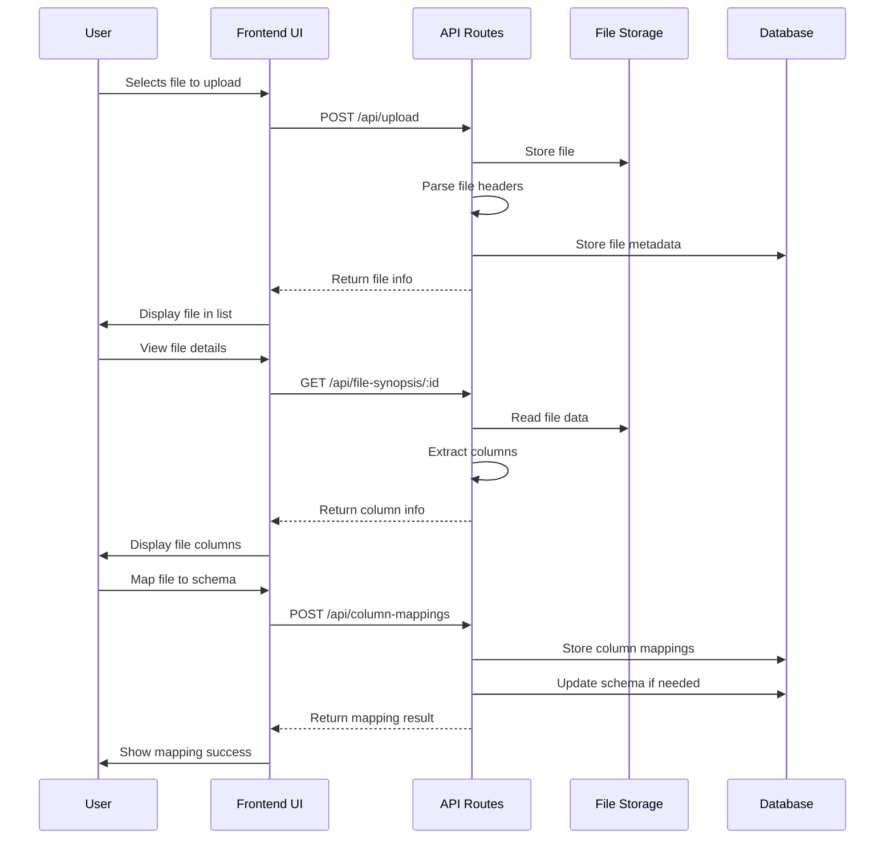

# File Upload Process

This document details the file upload process in RapidDataChat, including the UI components, API endpoints, and data flow involved.

## Overview

The file upload process allows users to upload data files (CSV, Excel), extract column information, and map these columns to global schemas. This is a critical workflow that enables data normalization and querying.

## Process Flow



## Components Involved

### Frontend Components

1. **ImprovedDashboardLayout** (`components/layouts/ImprovedDashboardLayout.tsx`)

   - Provides the overall layout structure
   - Contains the file upload section in the sidebar
   - Manages panel visibility and state persistence

2. **FilesPane** (`components/panels/FilesPane.tsx`)

   - Container for file upload and file list components
   - Handles file selection and management

3. **FileList** (`components/FileList.tsx`)

   - Displays the list of uploaded files
   - Shows file metadata (name, size, format, status)
   - Displays extracted columns for each file
   - Handles file deletion and navigation to file details

4. **FileUpload** (`components/FileUpload.tsx`)

   - Provides the file upload interface
   - Handles file selection and submission
   - Shows upload progress and status

5. **ColumnMappingInterface** (`components/schema/ColumnMappingInterface.tsx`)
   - Interface for mapping file columns to schema columns
   - Suggests automatic mappings based on column names
   - Allows manual mapping creation
   - Handles transformation rules for data normalization

### Backend Components

1. **Upload API** (`src/pages/api/upload.ts`)

   - Handles file upload requests
   - Validates file format and size
   - Stores files in the appropriate location
   - Creates file metadata records in the database
   - Initiates asynchronous file processing

2. **File Synopsis API** (`src/pages/api/file-synopsis/[id].ts`)

   - Retrieves detailed information about a file
   - Extracts column information from file data
   - Returns file metadata and column structure

3. **Column Mappings API** (`src/pages/api/column-mappings.ts`)

   - Manages mappings between file columns and schema columns
   - Handles creation, retrieval, and deletion of mappings
   - Updates schemas with new columns when needed

4. **File Ingestion Service** (`lib/fileIngestion.ts`)

   - Parses uploaded files (CSV, Excel)
   - Extracts headers and data rows
   - Creates database tables for file data
   - Updates file status during processing

5. **File Utils** (`lib/fileUtils.ts`)
   - Utility functions for file handling
   - Manages file paths and storage
   - Handles file format detection and validation

## Detailed Workflow

### 1. File Upload

1. User navigates to the project dashboard
2. User clicks "Upload New Data" or expands the file upload section
3. User selects a file from their device
4. Frontend validates the file (format, size) and shows a preview
5. User confirms the upload
6. Frontend sends the file to the `/api/upload` endpoint
7. Backend stores the file and creates metadata records
8. Backend initiates asynchronous file processing
9. Frontend displays the file in the file list with "pending" status

### 2. File Processing

1. Backend processes the uploaded file asynchronously
2. File is parsed to extract headers and data
3. Data is stored in a database table
4. File status is updated to "processing" then "active" when complete
5. Frontend periodically checks file status or receives updates

### 3. Column Extraction

1. When a file is displayed in the file list, the component attempts to extract column information:
   - First, it tries to get columns from the file's metadata
   - If not available, it calls the `/api/file-synopsis/:id` endpoint
2. The backend extracts column information from the file data
3. Frontend displays the extracted columns in the file list

### 4. Column Mapping

1. User selects a file and navigates to the column mapping interface
2. System loads file columns and schema columns
3. System suggests automatic mappings based on column name similarity
4. User reviews and adjusts mappings as needed
5. User can add transformation rules for data normalization
6. User saves the mappings
7. Backend stores the mappings and updates the schema if needed
8. Frontend shows a success message and updates the UI

## Column Schema Evolution

When a new file with new columns is uploaded, the system can add these columns to the existing schema during the mapping process:

1. During column mapping, the system identifies columns that:
   - Have the same name in both the file and schema
   - Don't already exist in the schema
2. The system automatically adds these new columns to the schema
3. This allows the schema to evolve as new data files are added

The relevant code in `src/pages/api/column-mappings.ts`:

```typescript
// Check if there are any new columns to add to the schema
const newColumns = Object.entries(mappings).filter(([fileCol, schemaCol]) => {
  // If the file column and schema column have the same name and it doesn't exist in the schema
  return (
    fileCol === schemaCol &&
    !schemaToMap.columns.some((col) => col.name === schemaCol)
  );
});

// If there are new columns to add, update the schema first
if (newColumns.length > 0) {
  // Create new schema columns
  const columnsToAdd = newColumns.map(([colName]) => ({
    id: `col_${Date.now()}_${Math.random().toString(36).substring(2, 9)}`,
    name: colName,
    type: "text", // Default type
    description: `Added from file column: ${colName}`,
    isRequired: false,
    isNewColumn: true,
  }));

  // Update the schema with new columns
  const updatedSchema = {
    ...schemaToMap,
    columns: [...schemaToMap.columns, ...columnsToAdd],
  };

  await schemaService.updateGlobalSchema(updatedSchema);
}
```

## Current Limitations

1. **New Column Addition**: New columns are only added to the schema when:

   - The file column and schema column have the same name
   - The column doesn't already exist in the schema

2. **Manual Mapping Required**: Users must explicitly go through the column mapping process to add new columns from subsequent files.

3. **Naming Inconsistency**: The codebase has renamed some components (e.g., `SchemaManager` to `ColumnManager`) but still uses old naming in APIs and services.

## Recommended Improvements

1. **Enhance Column Mapping Logic**: Modify the column mapping logic to be more flexible about adding new columns, even when names don't match exactly.

2. **Automatic Column Detection**: Implement an option to automatically detect and add new columns from uploaded files without requiring manual mapping.

3. **Consistent Naming**: Update backend APIs and services to match the new naming convention (e.g., rename `/api/schema-management.ts` to `/api/column-management.ts`).

4. **Improved User Guidance**: Add clearer UI indicators and guidance to help users understand how to add new columns from subsequent files.
