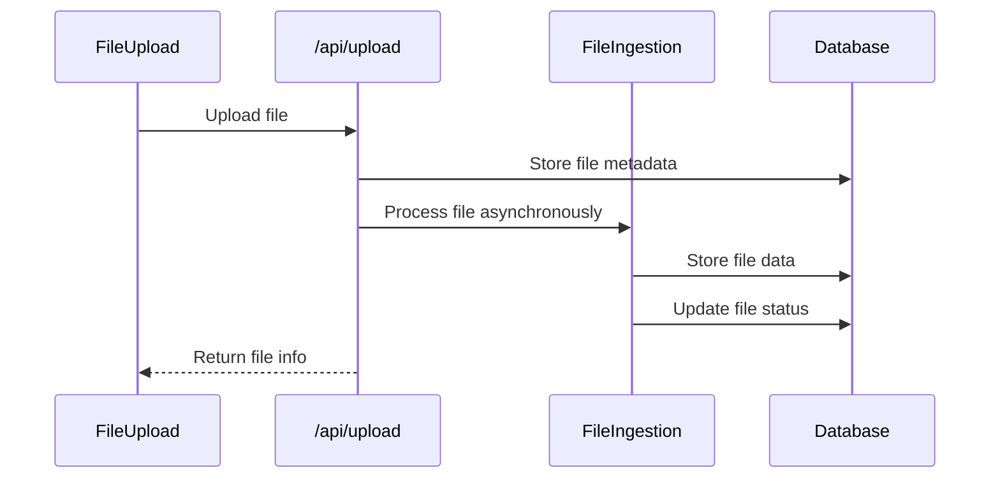
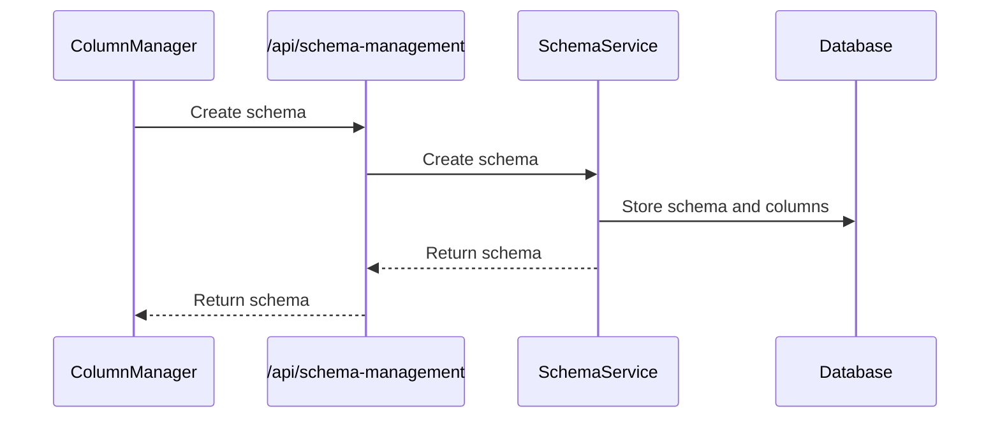
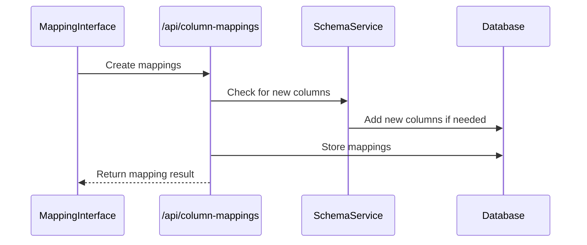
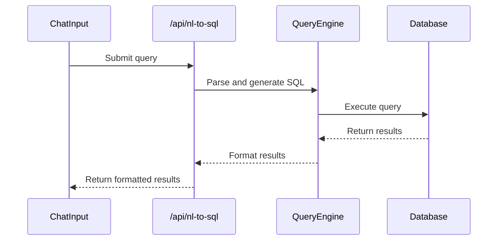
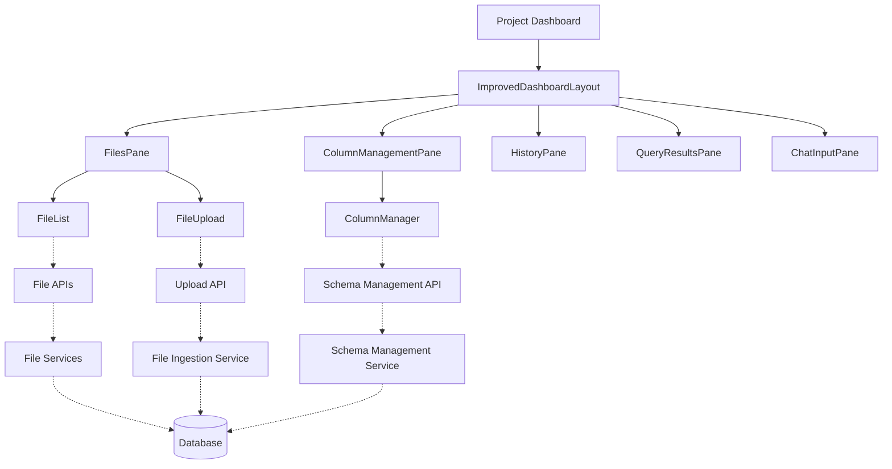

# Key Components

This document provides an overview of the key components in the RapidDataChat application, their responsibilities, and how they interact with each other.

## Frontend Components

### Layout Components

These components provide the structural layout for the application.

#### ImprovedDashboardLayout

**File**: `components/layouts/ImprovedDashboardLayout.tsx`

**Description**: The main layout component for the dashboard interface. It provides a responsive layout with a resizable sidebar and main content area.

**Responsibilities**:

- Manages the overall page structure
- Handles sidebar resizing
- Manages collapsible panels (history, files, column management)
- Persists layout preferences in localStorage
- Provides slots for various dashboard components

**Key Features**:

- Resizable sidebar with minimum and maximum width constraints
- Collapsible panels for different functionality
- Persistent layout preferences
- Fixed chat input at the bottom

### Panel Components

These components represent the main functional areas within the dashboard.

#### FilesPane

**File**: `components/panels/FilesPane.tsx`

**Description**: Container for file-related functionality, including file upload and file list.

**Responsibilities**:

- Displays the list of files for a project
- Provides file upload functionality
- Handles file selection
- Manages file deletion

#### ColumnManagementPane

**File**: `components/panels/ColumnManagementPane.tsx`

**Description**: Container for schema/column management functionality.

**Responsibilities**:

- Displays available schemas/columns
- Provides interface for creating and managing schemas
- Handles schema activation

#### HistoryPane

**File**: `components/panels/HistoryPane.tsx`

**Description**: Displays the history of queries executed by the user.

**Responsibilities**:

- Shows previous queries
- Allows rerunning previous queries
- Handles query selection

#### ImprovedQueryResultsPane

**File**: `components/panels/ImprovedQueryResultsPane.tsx`

**Description**: Displays the results of executed queries.

**Responsibilities**:

- Renders query results in a tabular format
- Provides pagination for large result sets
- Supports sorting and filtering
- Shows SQL query and explanation
- Handles column merges for display

#### ImprovedChatInputPane

**File**: `components/panels/ImprovedChatInputPane.tsx`

**Description**: Provides the interface for entering natural language queries.

**Responsibilities**:

- Accepts user input for queries
- Provides suggestions and autocomplete
- Handles query submission
- Shows loading state during query execution

### Functional Components

#### FileList

**File**: `components/FileList.tsx`

**Description**: Displays a list of uploaded files with their metadata and extracted columns.

**Responsibilities**:

- Renders file information (name, size, format, status)
- Extracts and displays file columns
- Handles file deletion
- Provides navigation to file details

**Key Features**:

- Automatic column extraction from file metadata
- API-based column fetching when metadata is insufficient
- Status indicators for files
- Error count display

#### FileUpload

**File**: `components/FileUpload.tsx`

**Description**: Provides the interface for uploading files.

**Responsibilities**:

- Handles file selection from the user's device
- Validates files (format, size)
- Submits files to the upload API
- Shows upload progress and status

#### ColumnManager (formerly SchemaManager)

**File**: `components/ColumnManager.tsx`

**Description**: Manages global schemas/columns for data normalization.

**Responsibilities**:

- Displays existing schemas
- Provides interface for creating schemas (from files or custom)
- Handles schema editing and deletion
- Manages schema activation

**Key Features**:

- Two schema creation modes: from files or custom
- Custom column definition interface
- Schema activation management
- Required/optional column marking

#### ColumnMappingInterface

**File**: `components/schema/ColumnMappingInterface.tsx`

**Description**: Interface for mapping file columns to schema columns.

**Responsibilities**:

- Displays file columns and schema columns
- Suggests automatic mappings
- Allows manual mapping creation
- Handles transformation rules
- Provides mapping preview

**Key Features**:

- Automatic mapping suggestions
- Transformation rule definition
- Mapping preview with validation
- Support for adding new columns to schemas

## Backend Components

### API Routes

#### Upload API

**File**: `src/pages/api/upload.ts`

**Description**: Handles file upload requests.

**Responsibilities**:

- Validates uploaded files
- Stores files in the appropriate location
- Creates file metadata records
- Initiates asynchronous file processing

**Key Features**:

- Support for CSV and Excel files
- File size and format validation
- Project association for uploaded files
- Asynchronous processing to avoid blocking

#### Schema Management API

**File**: `src/pages/api/schema-management.ts`

**Description**: Manages global schemas for data normalization.

**Responsibilities**:

- Creates schemas from file columns or custom definitions
- Updates schema structures
- Manages schema activation
- Handles schema deletion

**Key Features**:

- Schema creation from active files
- Custom schema creation
- Schema activation management
- Project-specific schemas

#### Column Mappings API

**File**: `src/pages/api/column-mappings.ts`

**Description**: Manages mappings between file columns and schema columns.

**Responsibilities**:

- Creates and retrieves column mappings
- Updates schemas with new columns during mapping
- Handles mapping deletion

**Key Features**:

- Automatic schema evolution during mapping
- Support for transformation rules
- Mapping validation

#### File Synopsis API

**File**: `src/pages/api/file-synopsis/[id].ts`

**Description**: Provides detailed information about a file, including its columns.

**Responsibilities**:

- Retrieves file metadata
- Extracts column information from file data
- Returns comprehensive file information

**Key Features**:

- Column extraction from various file formats
- Caching for performance
- Error handling for missing files

#### Natural Language to SQL API

**File**: `src/pages/api/nl-to-sql.ts`

**Description**: Converts natural language queries to SQL and executes them.

**Responsibilities**:

- Parses natural language queries
- Generates SQL queries
- Executes queries against the data
- Returns results with explanations

**Key Features**:

- Natural language understanding
- SQL generation
- Query execution
- Pagination and sorting
- Result formatting

### Service Layer

#### Schema Management Service

**File**: `lib/schemaManagement.ts`

**Description**: Core business logic for schema operations.

**Responsibilities**:

- Creates and updates schemas and schema columns
- Manages schema activation
- Handles column mappings
- Updates schemas during mapping

**Key Features**:

- Schema creation from file columns
- Custom schema creation
- Schema column management
- Schema activation

#### File Ingestion Service

**File**: `lib/fileIngestion.ts`

**Description**: Handles the processing of uploaded files.

**Responsibilities**:

- Parses uploaded files (CSV, Excel)
- Extracts headers and data rows
- Creates database tables for file data
- Updates file status during processing

**Key Features**:

- Support for multiple file formats
- Header extraction
- Data type inference
- Batch processing for large files

#### Column Mapping Service

**File**: `lib/columnMappingService.ts`

**Description**: Manages mappings between file columns and schema columns.

**Responsibilities**:

- Suggests mappings based on column similarity
- Retrieves file and schema columns
- Applies transformations to data
- Validates mappings

**Key Features**:

- Mapping suggestion algorithms
- Column similarity calculation
- Transformation application
- Type compatibility checking

## Component Interactions

### File Upload Flow

### Schema Creation Flow

### Column Mapping Flow

### Query Execution Flow

## Component Dependencies

This diagram shows the key dependencies between components, with frontend components at the top, API routes in the middle, and services and data storage at the bottom.
