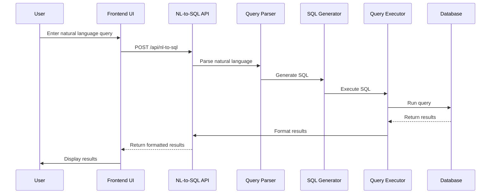

# Query Processing

This document details the query processing system in RapidDataChat, including how natural language queries are converted to SQL, executed, and presented to users.

## Overview

The query processing system allows users to query their data using natural language. The system converts these natural language queries into SQL, executes them against the data, and presents the results in a user-friendly format.

## Process Flow



## Components Involved

### Frontend Components

1. **ImprovedChatInputPane** (`components/panels/ImprovedChatInputPane.tsx`)

   - Provides the interface for entering natural language queries
   - Handles query submission
   - Shows loading state during query execution

2. **ImprovedQueryResultsPane** (`components/panels/ImprovedQueryResultsPane.tsx`)

   - Displays query results in a tabular format
   - Provides pagination, sorting, and filtering
   - Shows SQL query and explanation
   - Handles column merges for display

3. **HistoryPane** (`components/panels/HistoryPane.tsx`)
   - Displays query history
   - Allows rerunning previous queries

### Backend Components

1. **NL-to-SQL API** (`src/pages/api/nl-to-sql.ts`)

   - Receives natural language queries
   - Coordinates the query processing pipeline
   - Returns formatted results

2. **Query Utils** (`lib/queryUtils.ts`)
   - Contains utility functions for query processing
   - Handles SQL generation and execution
   - Formats query results

## Detailed Workflow

### 1. Query Input

1. User enters a natural language query in the ImprovedChatInputPane
2. The component validates the query and shows a loading state
3. The query is sent to the `/api/nl-to-sql` endpoint along with context:
   - Project ID
   - Selected file ID (optional)
   - Pagination parameters
   - Sorting parameters
   - Filtering parameters

### 2. Query Parsing

1. The NL-to-SQL API receives the query
2. The query parser analyzes the natural language query
3. The parser identifies:
   - The intent of the query (select, aggregate, filter, etc.)
   - The entities being queried (tables, columns)
   - The conditions and constraints
   - The sorting and grouping requirements

### 3. SQL Generation

1. Based on the parsed query, the SQL generator creates an SQL query
2. The generator considers:

   - The active schema and its columns
   - The column mappings for the relevant files
   - The transformation rules for the columns
   - The query parameters (pagination, sorting, filtering)

3. The generated SQL includes:
   - SELECT clause with the requested columns
   - FROM clause with the appropriate tables
   - WHERE clause with the specified conditions
   - ORDER BY clause for sorting
   - LIMIT and OFFSET clauses for pagination

### 4. Query Execution

1. The query executor runs the generated SQL against the database
2. The executor handles:
   - Connection to the database
   - Query execution
   - Error handling
   - Result retrieval

### 5. Result Formatting

1. The raw query results are formatted for presentation
2. The formatting includes:
   - Converting database types to JSON-compatible types
   - Applying column merges if specified
   - Calculating pagination metadata
   - Adding execution time information

### 6. Result Presentation

1. The formatted results are returned to the frontend
2. The ImprovedQueryResultsPane displays:
   - The result data in a tabular format
   - The generated SQL query
   - An explanation of how the query was processed
   - Pagination controls
   - Sorting and filtering options

## Query Context

The query processing system uses several types of context to improve query accuracy:

### Project Context

- The active project provides the scope for the query
- Only files and schemas within the project are considered

### Schema Context

- The active schema defines the column structure
- Column mappings connect file columns to schema columns
- Transformation rules normalize the data

### User Context

- Query history provides context for query understanding
- User preferences can influence query processing

## Query History

The system maintains a history of queries for each user and project:

1. When a query is executed, it's saved to the database
2. The HistoryPane displays the query history
3. Users can select a previous query to rerun it
4. Query history provides context for understanding new queries

## Advanced Features

### Pagination

The query processing system supports pagination for large result sets:

1. The frontend specifies page number and page size
2. The SQL generator adds LIMIT and OFFSET clauses
3. The result formatter includes pagination metadata
4. The UI displays pagination controls

### Sorting

Users can sort results by specific columns:

1. The frontend specifies sort column and direction
2. The SQL generator adds ORDER BY clauses
3. The UI indicates the current sort state

### Filtering

Users can filter results based on column values:

1. The frontend provides filter criteria
2. The SQL generator adds WHERE clauses
3. The UI displays active filters

### Column Merges

The system supports merging multiple columns for display:

1. Users can define column merges in the UI
2. The result formatter combines the specified columns
3. The UI displays the merged columns

## Example Query Processing

### Natural Language Query

```
Show me the top 10 customers by total order value in 2023
```

### Parsed Intent

```json
{
  "intent": "aggregate",
  "entity": "customers",
  "measure": "order value",
  "aggregation": "sum",
  "limit": 10,
  "sort": "descending",
  "timeframe": "2023"
}
```

### Generated SQL

```sql
SELECT
  c.customer_name,
  SUM(o.order_total) as total_order_value
FROM
  customers c
JOIN
  orders o ON c.customer_id = o.customer_id
WHERE
  EXTRACT(YEAR FROM o.order_date) = 2023
GROUP BY
  c.customer_id, c.customer_name
ORDER BY
  total_order_value DESC
LIMIT 10
```

### Formatted Results

```json
{
  "sqlQuery": "SELECT c.customer_name, SUM(o.order_total) as total_order_value...",
  "explanation": "This query finds the top 10 customers with the highest total order value in 2023...",
  "results": [
    {
      "customer_name": "Acme Corp",
      "total_order_value": 125000.50
    },
    {
      "customer_name": "XYZ Industries",
      "total_order_value": 98750.25
    },
    ...
  ],
  "executionTime": 0.125,
  "totalRows": 10,
  "totalPages": 1,
  "currentPage": 1
}
```

## Error Handling

The query processing system includes robust error handling:

### Parsing Errors

- When the system cannot understand the natural language query
- The user receives a clear error message with suggestions

### Execution Errors

- When the SQL query fails to execute
- The error message includes details about the failure

### Empty Results

- When a valid query returns no results
- The system provides feedback and suggestions

## Performance Considerations

The query processing system is designed for performance:

### Query Optimization

- The SQL generator creates optimized queries
- The system uses indexes and query planning

### Caching

- Frequently used queries can be cached
- Schema information is cached for faster access

### Pagination

- Large result sets are paginated to improve performance
- The system only retrieves the data needed for the current page

## Security Considerations

The query processing system includes several security measures:

### Input Validation

- All user input is validated before processing
- The system prevents SQL injection attacks

### Authorization

- Users can only query data they have access to
- Project-based access control restricts data visibility

### Query Limits

- The system enforces limits on query complexity
- Resource-intensive queries are throttled

## Future Improvements

Potential improvements to the query processing system include:

1. **Advanced Natural Language Understanding**: Improve the ability to understand complex queries
2. **Query Suggestions**: Provide suggestions as users type queries
3. **Visual Query Builder**: Allow users to build queries visually
4. **Query Templates**: Provide templates for common query patterns
5. **Query Optimization**: Automatically optimize queries for better performance
6. **Result Visualization**: Generate charts and graphs from query results
7. **Scheduled Queries**: Allow users to schedule recurring queries
8. **Query Sharing**: Enable sharing queries and results with other users
