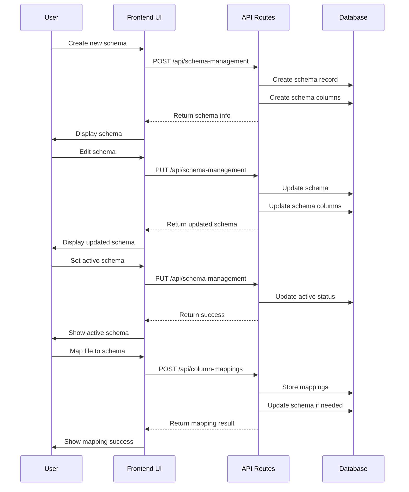
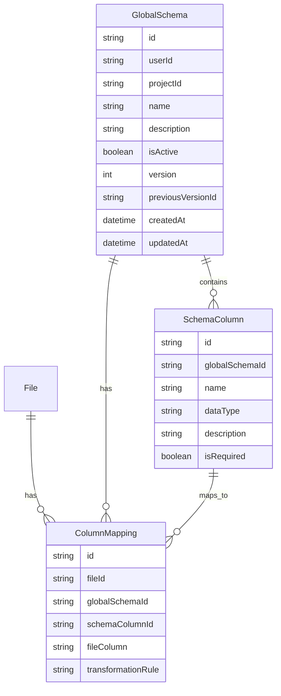

# Schema Management

This document details the schema management system in RapidDataChat, including how global schemas are created, managed, and used for data normalization.

## Overview

The schema management system allows users to create and manage global schemas that define a standardized structure for data across multiple files. This enables consistent querying and analysis across different data sources.

## Key Concepts

### Global Schema

A global schema is a collection of column definitions that represents a standardized data structure. It serves as a template for normalizing data from various sources.

### Schema Column

A schema column defines a single field within a global schema, including its name, data type, and other properties like whether it's required.

### Column Mapping

Column mappings connect columns from uploaded files to columns in a global schema, allowing data to be normalized according to the schema structure.

## Process Flow



## Components Involved

### Frontend Components

1. **ColumnManager** (`components/ColumnManager.tsx`)

   - Previously named `SchemaManager`
   - Displays existing schemas
   - Provides interface for creating, editing, and deleting schemas
   - Allows setting a schema as active

2. **ColumnManagementPane** (`components/panels/ColumnManagementPane.tsx`)

   - Container for the ColumnManager component
   - Handles integration with the dashboard layout

3. **ColumnMappingInterface** (`components/schema/ColumnMappingInterface.tsx`)

   - Interface for mapping file columns to schema columns
   - Suggests automatic mappings based on column names
   - Allows manual mapping creation
   - Handles transformation rules for data normalization

4. **NewColumnForm** (`components/schema/NewColumnForm.tsx`)
   - Form for adding new columns to a schema
   - Validates column names and types

### Backend Components

1. **Schema Management API** (`src/pages/api/schema-management.ts`)

   - Handles CRUD operations for schemas
   - Creates schemas from file columns or custom definitions
   - Updates schema structures
   - Manages active schema status

2. **Schema Management Service** (`lib/schemaManagement.ts`)

   - Core business logic for schema operations
   - Creates and updates schemas and schema columns
   - Manages schema versioning
   - Handles schema activation

3. **Column Mappings API** (`src/pages/api/column-mappings.ts`)

   - Manages mappings between file columns and schema columns
   - Updates schemas with new columns when needed

4. **Column Mapping Service** (`lib/columnMappingService.ts`)
   - Suggests mappings between file and schema columns
   - Applies transformations to data based on mappings

## Detailed Workflow

### 1. Schema Creation

There are two ways to create a schema:

#### From Files

1. User navigates to the column management section
2. User clicks "Create New Column" (schema)
3. User selects "Create from Files"
4. User enters a name and optional description
5. User submits the form
6. Backend extracts columns from active files
7. Backend creates a schema with these columns
8. Frontend displays the new schema

#### Custom Schema

1. User navigates to the column management section
2. User clicks "Create New Column" (schema)
3. User selects "Create Custom Column"
4. User enters a name and optional description
5. User adds custom column definitions (name, type)
6. User submits the form
7. Backend creates a schema with the custom columns
8. Frontend displays the new schema

### 2. Schema Editing

1. User selects a schema and clicks "Edit"
2. User can modify the schema name and description
3. User can mark columns as required/optional
4. User submits the changes
5. Backend updates the schema
6. Frontend displays the updated schema

### 3. Schema Activation

1. User selects a schema and clicks "Set Active"
2. Backend updates the schema's active status
3. Frontend displays the schema as active
4. The active schema is used for data normalization and querying

### 4. Schema Evolution

When new files with new columns are uploaded, the schema can evolve in two ways:

#### Manual Addition

1. User edits a schema
2. User adds new columns manually
3. Backend updates the schema

#### Automatic Addition During Mapping

1. User maps a file to a schema
2. System identifies new columns that don't exist in the schema
3. System adds these columns to the schema automatically
4. This allows the schema to evolve as new data files are added

## Schema Data Model



## Code Example: Schema Creation

```typescript
// Create a new schema from files
const response = await fetch("/api/schema-management", {
  method: "POST",
  headers: {
    "Content-Type": "application/json",
  },
  body: JSON.stringify({
    action: "create_from_files",
    name: newColumnName,
    description: newColumnDescription,
    userId: userId,
    projectId: projectId,
  }),
});

// Create a custom schema
const response = await fetch("/api/schema-management", {
  method: "POST",
  headers: {
    "Content-Type": "application/json",
  },
  body: JSON.stringify({
    action: "create_with_columns",
    name: newColumnName,
    description: newColumnDescription,
    columns: validColumns,
    userId: userId,
    projectId: projectId,
  }),
});
```

## Code Example: Schema Evolution During Mapping

```typescript
// Check if there are any new columns to add to the schema
const newColumns = Object.entries(mappings).filter(([fileCol, schemaCol]) => {
  // If the file column and schema column have the same name and it doesn't exist in the schema
  return (
    fileCol === schemaCol &&
    !schemaToMap.columns.some((col) => col.name === schemaCol)
  );
});

// If there are new columns to add, update the schema first
if (newColumns.length > 0) {
  // Create new schema columns
  const columnsToAdd = newColumns.map(([colName]) => ({
    id: `col_${Date.now()}_${Math.random().toString(36).substring(2, 9)}`,
    name: colName,
    type: "text", // Default type
    description: `Added from file column: ${colName}`,
    isRequired: false,
    isNewColumn: true,
  }));

  // Update the schema with new columns
  const updatedSchema = {
    ...schemaToMap,
    columns: [...schemaToMap.columns, ...columnsToAdd],
  };

  await schemaService.updateGlobalSchema(updatedSchema);
}
```

## Current Limitations

1. **Naming Inconsistency**: The codebase has renamed UI components from `SchemaManager` to `ColumnManager` but still uses "schema" terminology in the backend.

2. **Limited Schema Evolution**: New columns are only added to the schema during mapping when they have the same name as the file column.

3. **No Schema Versioning**: While the data model includes version fields, there's no robust versioning system implemented.

4. **Manual Mapping Required**: Users must explicitly map files to schemas to trigger schema evolution.

## Recommended Improvements

1. **Consistent Naming**: Update backend APIs and services to match the new "column" terminology.

2. **Enhanced Schema Evolution**: Improve the logic for adding new columns to schemas, making it more flexible and user-friendly.

3. **Schema Versioning**: Implement proper schema versioning to track changes over time.

4. **Automatic Schema Updates**: Add options for automatically updating schemas when new files are uploaded.

5. **Schema Templates**: Provide predefined schema templates for common data structures.

6. **Schema Validation**: Add more robust validation for schema structures and column types.
